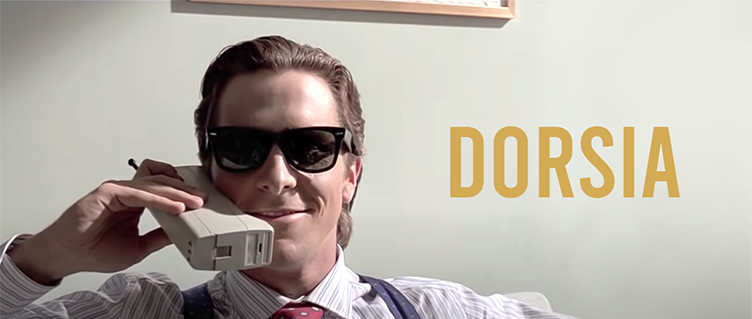

   

<h3 align="center"> 
   Fine Dining Restaurant Static Webpage
</h3>

# Description
*Dorsia* is my first foray into trying out SCSS as a replacement to standard CSS.

## Feature
The main feature of *Dorsia* is a fully-responsive webpage created using SCSS.

## Theme
The chosen theme of *Dorsia* is a fine dining restaurant based on the fictional story, *American Psycho*.

# Requirements
No special requirements.
- Clone this repository to your desktop
- Navigate to the top level of the directory
- Open index.html in your browser.

# Technologies
- HTML5
- SCSS
- Adobe Photoshop 2023

# Issues & Bugs

## Issues
N/A

## Bugs
N/A

# Credits
Credits go to Code and Create, George Lomidze and Lasha Nozadze, whose course I followed along with to help me create this project.

- [Code and Create](https://www.udemy.com/course/sass-the-complete-sass-course-css-preprocessor/)